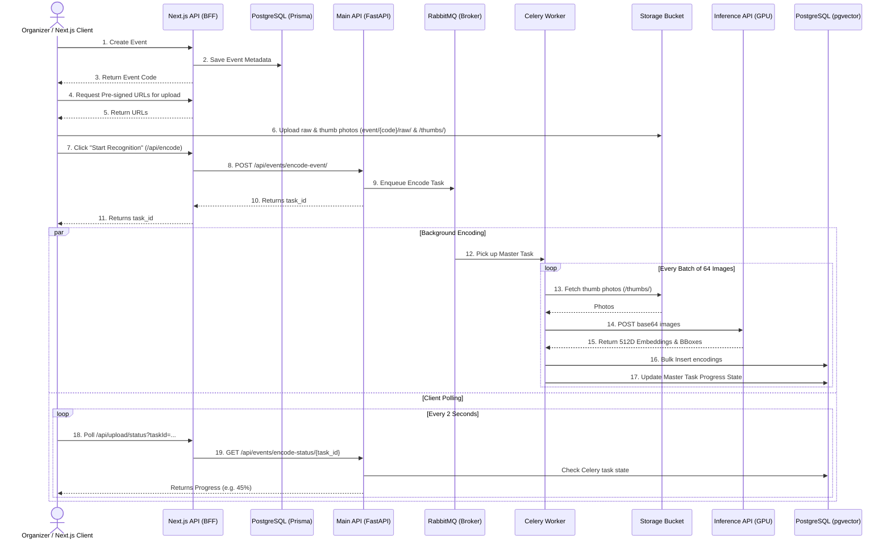
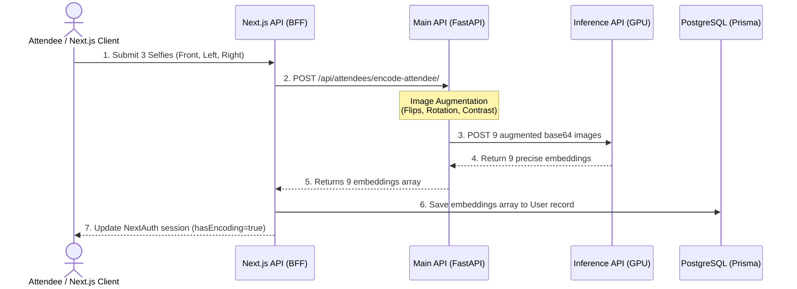
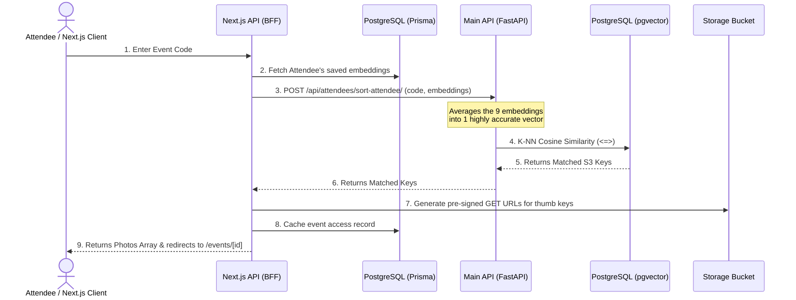
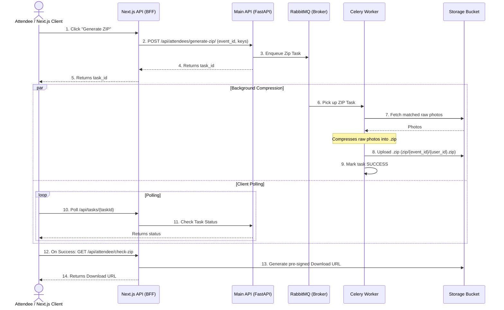
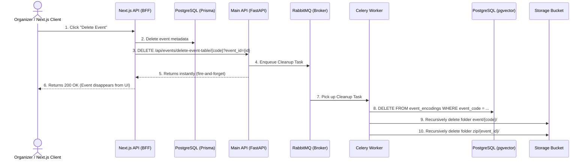

# Eventsnap Full-Stack Workflows

This document contains Mermaid sequence diagrams detailing the asynchronous data flow across the entire Eventsnap architecture, spanning from the Next.js frontend to the FastAPI backend, Celery workers, PostgreSQL databases, and Storage Buckets.

## 1. Event Creation & Photo Upload (Organizer)

When an organizer creates an event and uploads a massive folder of photos, the files are uploaded directly to the Storage Bucket using pre-signed URLs to reduce server load. The AI encoding is then offloaded to background Celery workers so the frontend is never blocked.

## 2. Registration & Face Encoding (Attendee)

When an attendee registers, they use their webcam to capture 3 selfies. The 512D face embeddings are stored directly in their NextAuth user profile via Prisma, so they only ever have to register their face once.

## 3. Event Scanning & Matching (Attendee)

When an attendee wants to find their photos, the backend leverages pgvector to perform a lightning-fast K-Nearest Neighbors (K-NN) cosine similarity search against the millions of faces found in the event.

## 4. ZIP Generation & Download (Attendee)

Attendees can download all their matched photos as a ZIP file. Because compressing hundreds of high-res photos is computationally heavy and slow, this is handled asynchronously by the Celery Worker.

## 5. Event Deletion & Cleanup (Organizer)

To prevent Next.js serverless timeouts when deleting an event with thousands of photos and embeddings, the heavy cleanup is delegated to the Python backend.

