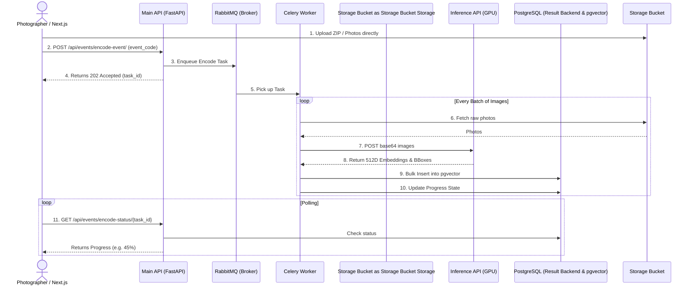
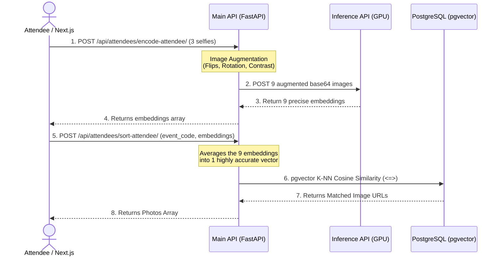
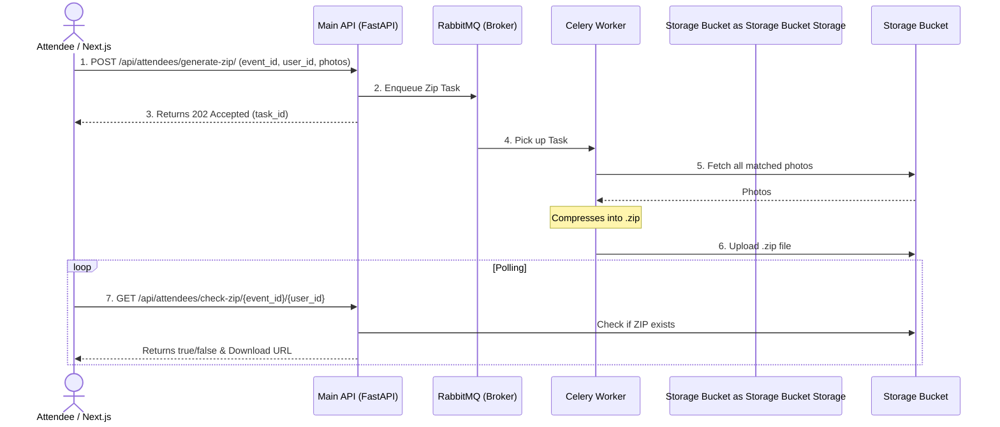

# Eventsnap Workflows

This document contains Mermaid sequence diagrams detailing the asynchronous data flow across the Eventsnap Hexagonal Architecture.

## 1. Event Encoding Workflow (Background Processing)

When a photographer uploads a massive event folder, the Main API delegates the heavy lifting to the background Celery workers so the frontend is never blocked.

## 2. Attendee Sorting Workflow (Lightning Fast Matching)

When an attendee wants to find their photos, the Main API uses Data Augmentation and highly-optimized pgvector queries to match them in milliseconds.

## 3. ZIP Generation Workflow

Attendees can download all their matched photos as a ZIP file. This is also handled asynchronously by the Celery Worker.

